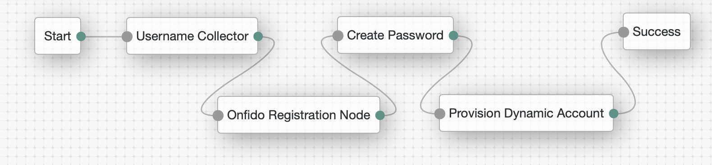
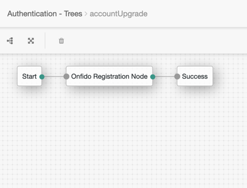
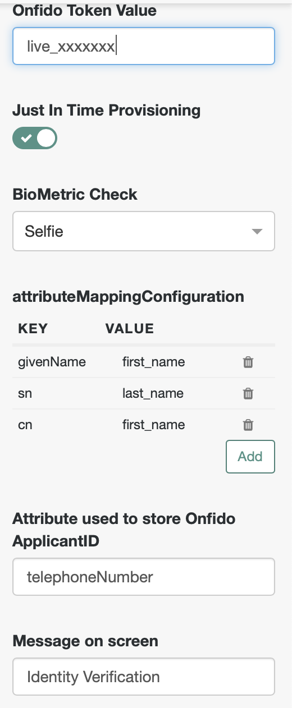
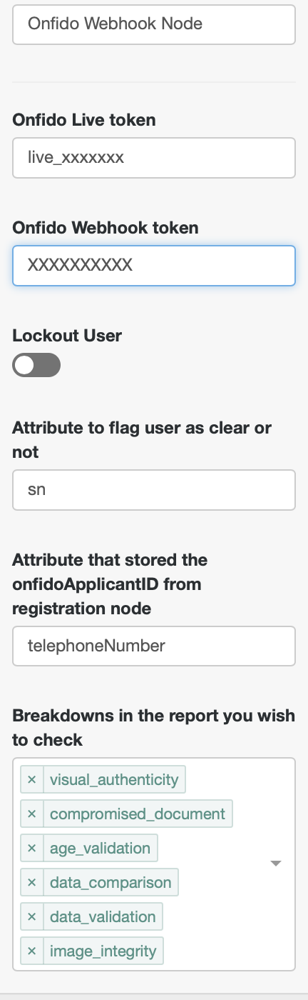

<!--
 * The contents of this file are subject to the terms of the Common Development and
 * Distribution License (the License). You may not use this file except in compliance with the
 * License.
 *
 * You can obtain a copy of the License at legal/CDDLv1.0.txt. See the License for the
 * specific language governing permission and limitations under the License.
 *
 * When distributing Covered Software, include this CDDL Header Notice in each file and include
 * the License file at legal/CDDLv1.0.txt. If applicable, add the following below the CDDL
 * Header, with the fields enclosed by brackets [] replaced by your own identifying
 * information: "Portions copyright [year] [name of copyright owner]".
 *
 * Copyright 2019 ForgeRock AS.
-->
# **Onfido Registration Node**

A simple authentication node for ForgeRock's Access Manager 6.1 and above.

## **Whats an Onfido?**

Onfido is the new identity standard for the internet. Our AI-based technology assesses whether a user’s government-issued ID is genuine or fraudulent, and then compares it against their facial biometrics. Onfido helps end users bring their Physical Identities to the Digital World providing it's customers with a higher level of assurance of their end users.

## **What's in the package**

Once built and dropped into ForgeRock 2 nodes will be available.
1) Onfido Registration Node
2) Onfido Webhook node

## **Installation Steps**

### Steps

1) Download the latest version of the Onfido integration jar from 
[here](https://github.com/ForgeRock/Onfido-Auth-Tree-Node/releases/latest).

2) Copy the jar file to the WEB-INF/lib/ folder where AM is deployed.

3) Restart the AM for the new plug-in to become available.

**Onfido Registration Node**: Collects and sends the document and biometric to the Onfido Back end. This node
 also uses Onfido's Autofill endpoint to get the User Attributes off the document for possible provisioning later.

**Onfido Webhook Node**: Retrieves the Identity Verification Report from Onfido and update the users profile
 accordingly.

## **User Journeys**
 
 The Onfido/ForgeRock integration user journey supports both Registration as a Service and higher level of assurance
 use cases. For Registration as a service end users do not yet have an identity provisioned in the ForgeRock platform.

 ## **Use Case: Registration as a Service**

The Tree should be configured as above. The Username Collector is there to allow the user to pick a username for
subsequent logins to ForgeRock Access Manager. The Onfido Registration Node will then initiate the JavaScript SDK on
the Access Manager Login page. Onfido SDK will take over and take the user through the Onfido Identity Verification
Flow (see screenshots at bottom for flow). Next the Create Password Node will ask the user to select a password for
 their subsequent logins and the Provision Dynamic Account Node will take the information from the previous three nodes
  and create an identity in the ForgeRock Platform. User will be auto-logged in at the end of this flow.

## **Use Case: Known User, Higher Level of Assurance**

The Tree should be configured as above. This tree/user journey is built for an already logged in user to be redirected through and trigger Onfido Identity Verification. This is for when a user already has an identity within the ForgeRock Platform, but higher level of assurance is needed on the account. For example a user who has signed up for a digital identity for a bank to review and track offers but has now decided to sign up for for a checking or savings account. In this case the user is already known but no assurance can be attached to the account. Pushing the logged in user through the Tree above will start the process to attach a higher level of assurance to the digital account.

## **Configuration: Onfido Registration Node** 

| Configuration Name        | Explanation           |
| ------------- |:-------------|
| Live Token     | The Onfido Registration Node needs A Live Token Provided by Onfido. To get this Token please go to the Onfido Dashboard at https://onfido.com/dashboard/ and navigate to the Token tab. |
| Just in Time Provisioning     | JIT provisioning should be turned on in the case of RaaS UseCase and Off in the Level of Assurance UseCase. This is used to initiate the creation of the Shared Object used by the Dynamic Provisioning node and is only needed in Registration as a service usecases.      |
| BioMetric Check | This is used to tell the SDK if it should initiate a Document only check; Document and Selfie Check; Document and Liveness Check      |
| Attribute Mapping Configuration| Used to map the attributes that come from the Onfido AutoFill endpoint to LDAP attributes inside the ForgeRock platform|
|Onfido ApplicantID Attribute| Attribute used to store Onfido ApplicantID for matching up the Identity Verification Report when it comes in
|Messages| Messages on the Onfido user flow that can be customized|

## **Onfido Webhook Tree**

The Onfido Webhook Node/Tree as seen above is used to receive the report from Onfido as well as find and update the
user inside of ForgeRock that corresponds to the Report. If you are familiar with ForgeRock, normally Trees are
  used to log users in and provide SSOTokens but when called with specific Query Params you send information through a tree without returning an SSO Token. This is a very important note and the configuration steps below must be followed to make sure that an SSO Token is not created.

### Node Configuration

| Configuration Name        | Explanation           |
| ------------- |:-------------|
| Live Token     | The Onfido Registration Node needs A Live Token Provided by Onfido. To get this Token please go to the Onfido Dashboard at https://onfido.com/dashboard/ and navigate to the Token tab. |
| Onfido Webhook Token    | Used to check the HMAC signature of the calls coming in from Onfido     |
| Lockout User | If a user fails verification should the user be locked out. If LockOut is turned on then not only is the user account deactivated but all current sessions by that user will be immediately deactivated as well      |
|Onfido Pass/Fail Flag Attribute| Used to store if  Identity Verification was passed or failed.|
|Onfido ApplicantID Attribute| Attribute used to store Onfido ApplicantID for matching up the Identity Verification Report when it comes in
|Onfido Breakdowns| Allows you to customize which of the Onfido Report Breakdowns are evaluated|
 
### Onfido Dash configuration

In the Onfido Dashboard go to Developers then webhooks to configure a new webhook. The Token which is covered by the red block in the above screen shot is the webhook token needed by the webhook node. To generate one click on the button that says **Create Webhook** a pop up will come up.

Fill out the URL like below using your own url making sure to have **noSession=true** in the url to ensure that an SSOToken is not created.

**https://{{openam_hostname}}/openam/json/realms/root/authenticate?authIndexType=service&authIndexValue={webhookTreeName}&noSession=true**

Also make sure to uncheck everything except for the Check Completed this is the only notification the webhook tree/node needs.

After clicking save you will be returned to the screen from the first screen shot in the section and you will be able to take the webhook token to configure the webhook node.

