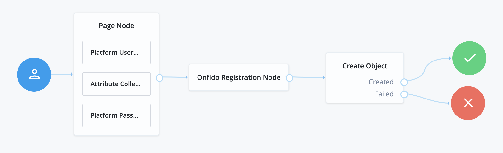
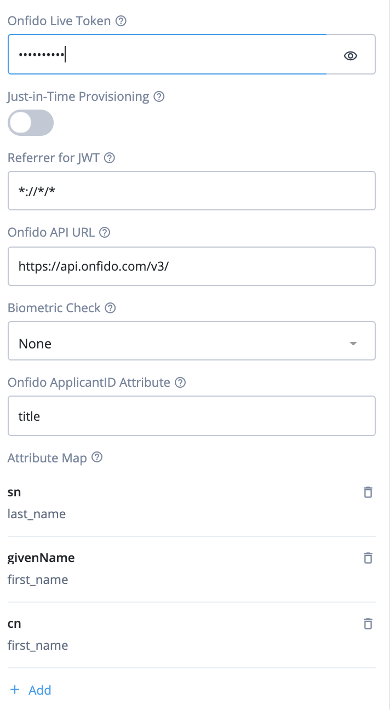
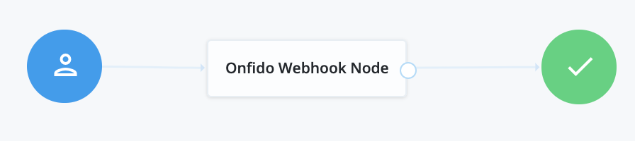
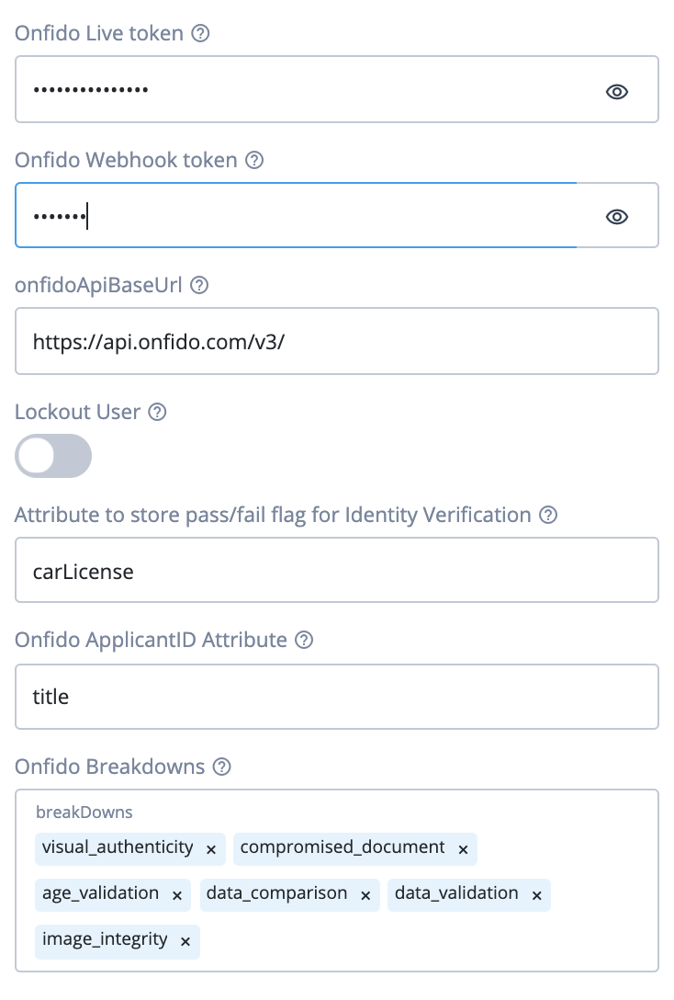
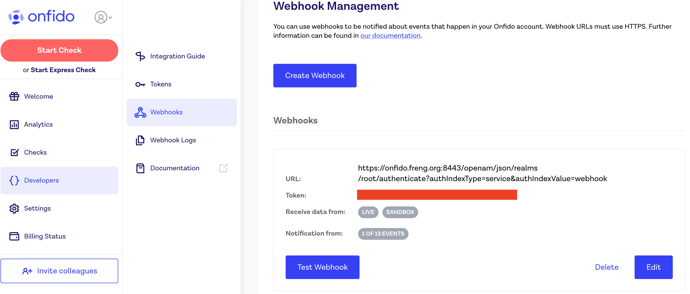
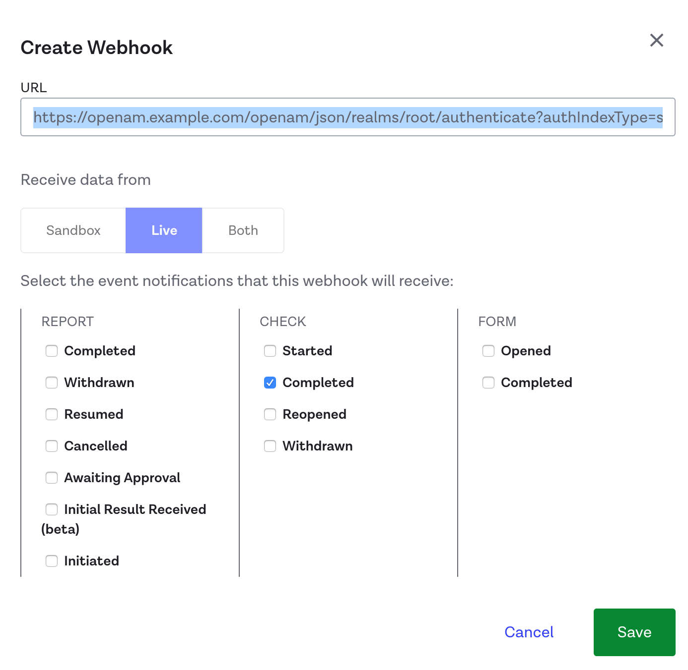
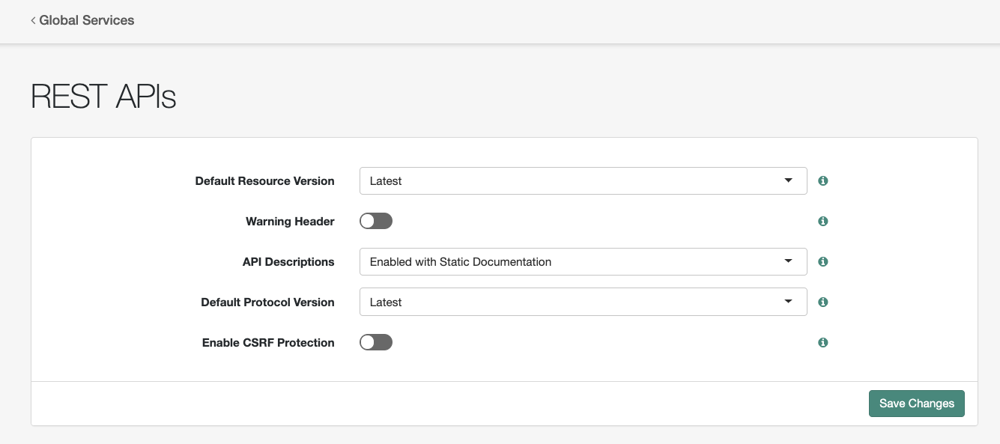
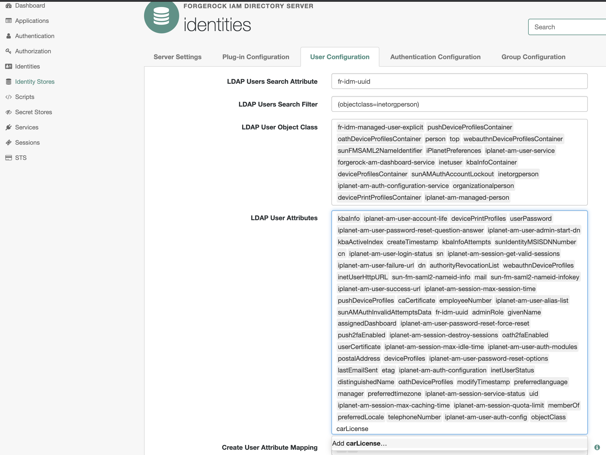

<!--
 * The contents of this file are subject to the terms of the Common Development and
 * Distribution License (the License). You may not use this file except in compliance with the
 * License.
 *
 * You can obtain a copy of the License at legal/CDDLv1.0.txt. See the License for the
 * specific language governing permission and limitations under the License.
 *
 * When distributing Covered Software, include this CDDL Header Notice in each file and include
 * the License file at legal/CDDLv1.0.txt. If applicable, add the following below the CDDL
 * Header, with the fields enclosed by brackets [] replaced by your own identifying
 * information: "Portions copyright [year] [name of copyright owner]".
 *
 * Copyright 2019 ForgeRock AS.
-->
# **Onfido Registration Node**

A simple authentication node for ForgeRock's Access Manager 7.0 and above.

## **Whats an Onfido?**

Onfido is the new identity standard for the internet. Our AI-based technology assesses whether a user’s government-issued ID is genuine or fraudulent, and then compares it against their facial biometrics. Onfido helps end users bring their Physical Identities to the Digital World providing it's customers with a higher level of assurance of their end users.

## **What's in the package**

Once built and dropped into ForgeRock, 2 nodes will be available.
1) Onfido Registration Node
2) Onfido Webhook node

## **Installation Steps**

### Steps

1) Download the latest version of the Onfido integration jar from 
[here](https://github.com/ForgeRock/Onfido-Auth-Tree-Node/releases/latest).

2) Copy the jar file to the WEB-INF/lib/ folder where AM is deployed.

3) Restart the AM for the new plug-in to become available.

**Onfido Registration Node**

Collects and sends the document and, optionally, biometrics to the Onfido Back end. This node also uses Onfido's Autofill endpoint to get the User Attributes off the document for possible provisioning later.

**Onfido Webhook Node**

Retrieves the Identity Verification Report from Onfido and update the users profile accordingly.

## **User Journeys**
 
 The Onfido/ForgeRock integration user journey supports both Registration as a Service  and higher level of assurance use cases. For Registration as a Service, end users do not yet have an identity provisioned in the ForgeRock platform.

 ## **Use Case: Registration as a Service**

The Tree should be configured as above. The basic flow is as follows.

1. The Page Node, with its sub-nodes, gathers any required attributes needed to create a new identity such as e-mail, username, and password.
   

2. The Onfido Registration Node initiates the JavaScript SDK on the Access Manage Login page. The Onfido Web SDK takes over, guiding the user through the Onfido Identity Verification Flow. (See screenshots at bottom for this flow.)
   

3. After running through the Onfido Registration Node, the Create Object will create a resource with the information gathered by the previous nodes. And, the user will be automatically logged in once this flow succeeds.

**Note:** The Onfido Registration Node will overwrite attributes specified in the Attribute Map with the values read from the document the end user uploads. (See Configuration section below for list of document attributes available for mapping.)

## **Use Case: Known User, Higher Level of Assurance**

The Tree should be configured as above.

This tree/user journey is built for a user who is already logged in and needs to be redirected through the Onfido Identity Verification. This is used when a user already has an identity in the ForgeRock Platform, but a higher level of assurance is needed on the account. For example, a user who has signed up for a digital identity for a bank to review and track offers, but has now decided to sign up for a checking or savings account. In this case, the user is already known, but no assurance can be attached to the account. Pushing the logged in user through the tree above will start the process of attaching a higher level of assurance to the account.

## **Configuration: Onfido Registration Node** 

| Configuration Name        | Explanation           |
| ------------- |:-------------|
| Live Token    | The Onfido Registration Node needs a Live Token Provided by Onfido. To get this Token please go to the Onfido Dashboard at https://onfido.com/dashboard/ and navigate to the Token tab. |
| Just in Time Provisioning     | JIT Provisioning should be turned On for the RaaS Use Case. It should be turned Off for the Level of Assurance Use Case. It is used to initiate the creation of the Shared Object used by the Create Object Node, thus is only needed in Registration as a Service use cases.      |
| BioMetric Check | This is used to tell the Web SDK which type of check it should initiate: document-only, document-and-face, or document-and-video.      |
| Attribute Mapping Configuration| This is used to map the attributes that come from the Onfido AutoFill endpoint to object attributes inside the ForgeRock platform. The key is the ForgeRock IDM attribute, while the value is the Onfido attribute.|
|Onfido ApplicantID Attribute*| The IDM attribute that should be used to store the Onfido Applicant ID for matching up the Identity Verification Report when it comes in.
|Messages| Messages on the Onfido user flow that can be customized|

*Note: In a production system, the Onfido ApplicantID Attribute should be a new string attribute added to the IDM schema for use by the Onfido Registration node. The screenshots in this README show this attribute as `title`, but any attribute name can be used.

### **Mappable Onfido Attributes**

The Attribute Mapping Configuration tells the Registration Node how to map information retrieved from an uploaded document to attributes in ForgeRock IDM. The table here lists the possible Onfido attributes for mapping. Note that not every document will return all attributes listed.

| Onfido Attribute | Description |
| ------------- |:-------------|
| document_number | The official document number
| first_name | First Name |
| last_name | Last Name |
| middle_name | Middle Name |
| full_name | Full Name |
| spouse_name | Spouse Name (for French Documents) |
| window_name | Widow Name (for French Documents) |
| alias_name | Alias Name (for French Documents) |
| gender | Value will be one of `Male` or `Female` |
| date_of_birth | Date of Birth in YYYY-MM-DD format |
| date_of_expiry | Date of Birth in YYYY-MM-DD format |
| nationality | Nationality, given as a 3-letter ISO code |
| mrz_line_1 | Line 1 of MRZ |
| mrz_line_2 | Line 2 of MRZ |
| mrz_line_3 | Line 3 of MRZ |
| address_line_1 | Line 1 of Address (Usually Street in U.S. Address) |
| address_line_2 | Line 2 of Address (Usually Apt or Bldg in U.S. Address) |
| address_line_3 | Line 3 of Address (Usually City in U.S. Address) |
| address_line_4 | Line 4 of Address (Usually Postal Code in U.S. Address) |
| address_line_5 | Line 5 of Address (Usually State/Province in U.S. Address) |

## **Onfido Webhook Tree**

The Onfido Webhook Node/Tree is used to receive the report from Onfido.

The tree also finds and updates the user inside of ForgeRock that corresponds to the Report. If you are familiar with ForgeRock, normally  Trees are used to log users in and provide SSOTokens. But, when called with specific Query Params, you can send information through a tree without returning an SSO Token. This is very important, and  the configuration steps below must be followed to make sure that an SSO Token is not created for this flow.

### Node Configuration

| Configuration Name        | Explanation           |
| ------------- |:-------------|
| Live Token     | The Onfido Registration Node needs A Live Token Provided by Onfido. To get this Token please go to the Onfido Dashboard at https://onfido.com/dashboard/ and navigate to the Token tab. |
| Onfido Webhook Token    | Used to check the HMAC signature of the calls coming in from Onfido     |
| Lockout User | If a user fails verification, should the user be locked out? If LockOut is turned On, then not only is the user account deactivated, but all current sessions by that user will be deactivated immediately as well.      |
|Onfido Pass/Fail Flag Attribute| Used to store if  Identity Verification was passed or failed.|
|Onfido ApplicantID Attribute| LDAP Attribute used to store Onfido ApplicantID for matching up the Identity Verification Report when it comes in.
|Onfido Breakdowns| Allows you to customize which of the Onfido Report Breakdowns are evaluated|

**Note:**

There is a small disparity between the Onfido Registration Node and the Onfido Webhook Node.

* The Onfido Applicant ID Attribute in the Registration Node is an IDM Attribute
* The Onfido Applicant ID Attribute in the Webhook Node is the related LDAP Attribute

You will need to ensure that your LDAP User Attributes in DS include the attribute used to store the results from the Onfido Webhook Node.
 
### Onfido Dashboard configuration

In the Onfido Dashboard:

Go to Developers, then Webhooks to configure a new webhook. The token, which is covered by a red block above, is the webhook token needed by the webhook node. To generate one, click on the button that says **Create Webhook.** A screen like the one below will pop up.

Fill out the URL like below, using your own url and making sure to have **noSession=true** in the url. This will ensure that an SSOToken is not created.

**https://{{openam_hostname}}/openam/json/realms/root/authenticate?authIndexType=service&authIndexValue={webhookTreeName}&noSession=true**

Also make sure to uncheck everything except for the Check Completed option. This is the only notification the webhook tree/node needs.

After clicking save you will be returned to the screen from the first screen shot in this section, and you will be able to use the generated webhook token to configure the webhook node.

Finally, login to the Access Management Console and navigate to `Configure` -> `Global Services` -> `REST APIs`and disable CSRF Protection

 
### **AM DS LDAP User Attribute Configuration**

This setup will need to be done in the Access Management Native Console.

1. In the Access Management Native Console, click on Identity Stores in the left menu.

2. Select the `identities` Identity Store from the Identity Stores list
 
3. Select the User Configuration tab

4. In the LDAP User Attributes section, add the user attribute that will store the result from the Onfido Webhook Node. (In the screenshot below, the new attribute is `carLicense`, but any attribute name can be used.)

